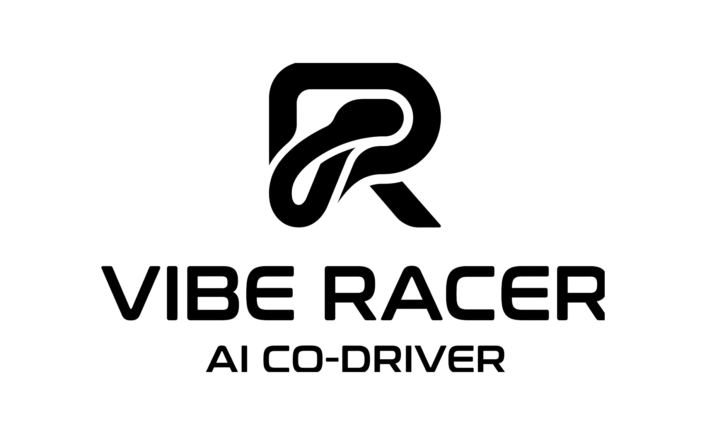

<p align="center">
  
</p>

<p align="center">
  <strong>Your AI race engineer. Five laps from objective to shipped code — you call the pit stops.</strong>
</p>

<p align="center">
  <a href="https://www.npmjs.com/package/vibe-racer"></a>
  <a href="LICENSE"></a>
  <a href="https://github.com/teripaquitinho/vibe-racer/stargazers"></a>
  <a href="https://nodejs.org">= 20" /></a>
  <a href="https://docs.anthropic.com/en/docs/claude-code/sdk"></a>
</p>

<p align="center">
  <a href="https://teripaquitinho.github.io/vibe-racer/"><strong>📚 Documentation</strong></a>
</p>

---

## What is vibe-racer?

Your project is the car. Every pipeline stage is a lap. Every human checkpoint is a pit stop. vibe-racer is the race engineer in your ear — it does the heavy work, calls the strategy, and hands you the final say on every decision.

The AI agent pre-fills its recommended answers to every question. You only edit what you disagree with.

## Get Started

### Prerequisites

- Node.js 20+
- [Anthropic API key](https://platform.claude.com/) (set `ANTHROPIC_API_KEY` env var, or run `claude login`)

### Install

```bash
npm install -g vibe-racer
```

### Quick start

```bash
# 1. Initialize in your project
cd your-project
vibe-racer init

# 2. Create a task
vibe-racer new "Add user authentication"

# 3. Write your objective in plans/0001_add-user-authentication/00_objective.md
#    Then tick the checkbox: - [x] Ready to advance to Objective Review

# 4. Drive the first lap
vibe-racer drive
```

The race engineer picks up the task, generates product questions pre-filled with its recommended answers, and commits them. Review the answers, edit only what you disagree with, tick the checkbox, and run `vibe-racer drive` again. Repeat through all five laps.

## The Five Laps

Each task races through 5 laps, producing 5 documents:

```
Lap 1          Lap 2          Lap 3         Lap 4        Lap 5
Objective  ->  Product    ->  Design    ->  Plan     ->  Execute
    |              |              |             |            |
  pit stop       pit stop       pit stop     pit stop     finish line
```

| Lap | Race engineer role | Output |
|---|---|---|
| 1. Objective review | Product Designer | Product questions |
| 2. Product review | Product Designer | Product spec + design questions |
| 3. Design review | Software Architect | Design spec + plan questions |
| 4. Plan review | Software Engineer | Implementation plan + execution playbook |
| 5. Execute | Software Engineer | Working code, milestone by milestone |

Small tasks can be flagged as trivial during objective review, skipping product and design laps.

## Commands

| Command | Description |
|---|---|
| `vibe-racer init` | Initialize vibe-racer in the current directory |
| `vibe-racer new <title>` | Create a new task with state.yml + objective template |
| `vibe-racer pitwall` | View the pit wall — live status for every car in the race |
| `vibe-racer pitwall --all` | Include completed tasks in pit wall output |
| `vibe-racer drive` | Drive the next lap — hand the car to the race engineer |
| `vibe-racer drive --task N` | Drive a specific task |
| `vibe-racer drive --retry` | Retry tasks in error state |
| `vibe-racer radio` | Pick up the team radio — open an interactive session with the race engineer at a pit stop |
| `vibe-racer radio --task N` | Open radio for a specific task |

## How It Works

- **State management**: Pipeline state is tracked via `state.yml` files in each task's plan folder
- **Pit stops**: The human signals readiness by ticking `- [x] Ready to advance to ...` at the bottom of each document
- **Radio calls**: If the race engineer needs more info, it appends follow-up questions and unchecks the checkbox
- **Git-native**: Branches are created per task, commits happen after each lap. No push — you control merging
- **Pre-filled answers**: The race engineer recommends answers to every question. You review and edit only disagreements

## Configuration

`.vibe-racer.yml` (created by `vibe-racer init`):

```yaml
repo: "https://github.com/owner/repo"  # optional - enables share links
plans_dir: "plans"                       # default
context:                                 # files loaded into Claude's context
  - README.md
  - CLAUDE.md
```

## Security

vibe-racer runs Claude sessions with autonomous permissions but enforces a multi-layered security system:

- **Path containment** — file operations restricted to the project directory and `/tmp`
- **Sensitive path blocklist** — `~/.ssh`, `~/.aws`, etc. are always denied
- **Bash filtering** — 19 dangerous commands blocked, with interpreter-aware network detection
- **Pre-commit secret scanning** — blocks commits containing API keys, private keys, or credentials
- **Audit log** — all guard denials logged to `.vibe-racer/audit.log`

For sensitive workloads, run inside Docker with `--network none`. See [Security](docs/security.md) for the full assessment.

## Documentation

Full documentation available at the [vibe-racer docs site](https://teripaquitinho.github.io/vibe-racer/).

## Environment Variables

| Variable | Required | Description |
|---|---|---|
| `ANTHROPIC_API_KEY` | Yes | Claude API key (or `claude login`) |

## Attribution

Built on [Claude Code SDK](https://docs.anthropic.com/en/docs/claude-code/sdk) by [Anthropic](https://anthropic.com).

## Contributing

See [CONTRIBUTING.md](CONTRIBUTING.md) for development setup and guidelines.

## License

[MIT](LICENSE)

---

If `vibe-racer` helps your crew get to the finish line, give us a ⭐ on [GitHub](https://github.com/teripaquitinho/vibe-racer)!
